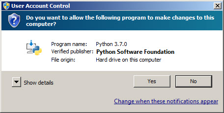

!!!Note
    This document shows downloading and installing Python 3.7.0 (32 bits) on Windows 7 in Summer 2018. You should download and install the latest version of Python. The current latest (as of Winter 2019) is Python 3.7.2, 64 bits.

Downloading
-----------

Click [Python Download].

The following page will appear in your browser:

Click the **Download Python 3.7.0** button.

The file named python-3.7.0.exe should start downloading into your standard download folder.

[Python Download]: https://www.python.org/downloads/

Installing
----------
Once the download is completed, double-click the file icon to open it, the following warning will be shown:

Click _Run_

A Python 3.7 (32-bit) Setup pop-up window will appear:

 Ensure that the **Install launcher for all users (recommended)** and the **Add Python 3.7 to PATH** checkboxes at the bottom are checked.

Highlight the **Install Now** (or **Upgrade Now**) message, and then click it.

A **User Account Control** pop-up window will appear, posing the question **Do you want the allow the following program to make changes to this computer:**

Click the Yes button.

A new Python 3.7 Setup pop-up window will appear with a Setup Progress message and a progress bar:

During installation, it will show the various components it is installing and move the progress bar towards completion. Soon, a new Python 3.7 Setup pop-up window will appear with a Setup was successfully message:

Click the Close button.

Python should now be installed.

This document was based on:[https://www.ics.uci.edu/~pattis/common/handouts/pythoneclipsejava/python.html](https://www.ics.uci.edu/~pattis/common/handouts/pythoneclipsejava/python.html)